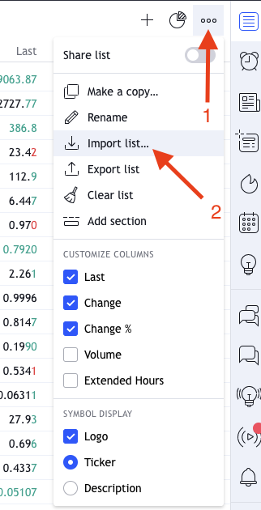

# tradingview-binance-usdt-tickers
__Tradingview whatchlist import file 2022__

- last update: _10/03/2022_

## How to import the file

### If you have the basic free plan:
- Step 1: Click on the '+' button
- Step 2: Paste the content of the file _binance_usdt_ticker.txt_ into the search bar (i.e: Open  _binance_usdt_ticker.txt_, CTRL+A, CTRL+C, click on the search bar, CTRL+V)
- Step 3: Press enter

### If you have the trading view pro plan:

- Step 1: Click on Settings
- Step 2: Click on Import list...
- Step 3: Select the file downloaded from this repository _binance_usdt_ticker_list.txt_

## How to contribute

Feel free to ask for other tickers
